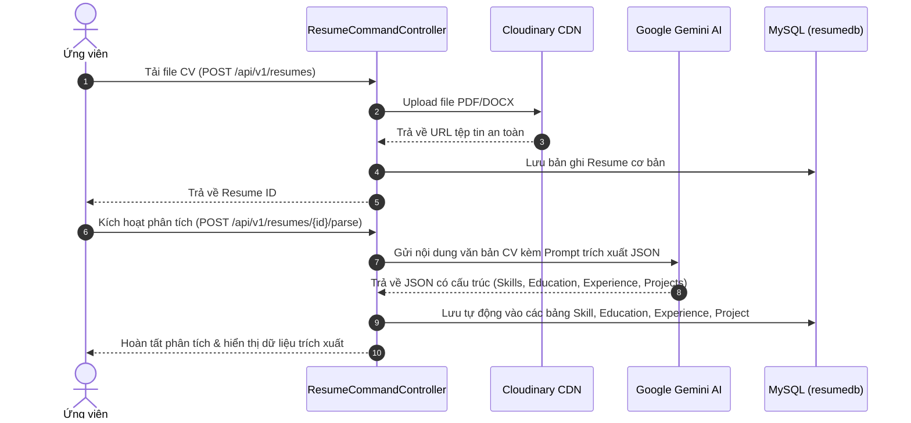

# 📄 Resume Service (Quản lý Hồ sơ CV & Tích hợp Trí tuệ nhân tạo Gemini AI)

`Resume-Service` đảm nhiệm việc lưu trữ, quản lý các bản CV/Resume của ứng viên, phân loại CV mặc định, quản lý các khối thông tin cấu trúc (Kỹ năng, Học vấn, Kinh nghiệm làm việc, Dự án cá nhân), đồng thời tích hợp **Google Gemini AI API** để tự động phân tích và trích xuất dữ liệu từ file CV (PDF/DOCX) được tải lên **Cloudinary CDN**.

---

## 📌 Thông tin tổng quan

- **Tên ứng dụng**: `resume-service`
- **Port mặc định**: `8086`
- **Cơ sở dữ liệu**: MySQL (`resumedb`) trên port `3308`
- **Swagger Documentation**: `http://localhost:8086/swagger-ui.html`
- **AI Engine**: Google Gemini Pro / Flash API
- **Lưu trữ tệp tin**: Cloudinary CDN
- **Axon Server**: `localhost:8124`

---

## 🤖 Cơ chế Tự động Phân tích CV bằng AI (Gemini AI Flow)



---

## 📋 Danh sách API Endpoints

### 1. Quản lý Tệp tin CV (`/api/v1/resumes`)

| Method | Endpoint | Mô tả | Quyền |
| :--- | :--- | :--- | :--- |
| `POST` | `/api/v1/resumes` | Tải lên file CV mới (PDF, DOC, DOCX) lên Cloudinary | Candidate |
| `GET` | `/api/v1/resumes` | Lấy danh sách toàn bộ CV của ứng viên đang đăng nhập | Candidate |
| `GET` | `/api/v1/resumes/{resumeId}` | Chi tiết một CV (kèm kỹ năng, học vấn, kinh nghiệm, dự án) | Candidate / Recruiter |
| `GET` | `/api/v1/resumes/default` | Lấy CV được đặt làm mặc định khi nộp đơn | Candidate |
| `PUT` | `/api/v1/resumes/{resumeId}/default` | Đặt CV này làm CV mặc định | Candidate |
| `DELETE` | `/api/v1/resumes/{resumeId}` | Xóa CV khỏi hệ thống và Cloudinary | Candidate |
| `POST` | `/api/v1/resumes/{resumeId}/parse` | **Phân tích CV bằng Gemini AI**: Tự động bóc tách thông tin | Candidate |

### 2. Quản lý Chi tiết Thông tin CV

- **Kỹ năng (`/api/v1/resumes/{resumeId}/skills`)**:
  - `POST`: Thêm kỹ năng cá nhân (`skillName`, `level`).
  - `PUT / DELETE /{skillId}`: Cập nhật trình độ hoặc xóa kỹ năng.
- **Học vấn & Bằng cấp (`/api/v1/resumes/{resumeId}/educations`)**:
  - `POST`: Thêm thông tin trường học (`schoolName`, `major`, `degree`, `startDate`, `endDate`, `description`).
  - `PUT / DELETE /{educationId}`: Sửa / Xóa học vấn.
- **Kinh nghiệm làm việc (`/api/v1/resumes/{resumeId}/experiences`)**:
  - `POST`: Thêm công ty đã làm việc (`companyName`, `position`, `startDate`, `endDate`, `currentJob`, `description`).
  - `PUT / DELETE /{experienceId}`: Sửa / Xóa kinh nghiệm.
- **Dự án nổi bật (`/api/v1/resumes/{resumeId}/projects`)**:
  - `POST`: Thêm dự án cá nhân (`projectName`, `role`, `description`, `technologies`, `projectUrl`).
  - `PUT / DELETE /{projectId}`: Sửa / Xóa dự án.

---

## ⚙ Cấu hình chính (`application.yaml`)

```yaml
server:
  port: 8086

spring:
  application:
    name: resume-service
  datasource:
    url: jdbc:mysql://localhost:3308/resumedb?useSSL=false&serverTimezone=Asia/Ho_Chi_Minh
    username: root
    password: <YOUR_PASSWORD>
  security:
    oauth2:
      resourceserver:
        jwt:
          issuer-uri: http://localhost:8080/realms/jobhuntly

cloudinary:
  cloud-name: <CLOUDINARY_CLOUD_NAME>
  api-key: <CLOUDINARY_API_KEY>
  api-secret: <CLOUDINARY_API_SECRET>

gemini:
  api-key: <GOOGLE_GEMINI_API_KEY>
```

---

## 🏃 Hướng dẫn chạy Service

```bash
cd Resume-Service
mvn spring-boot:run
```
